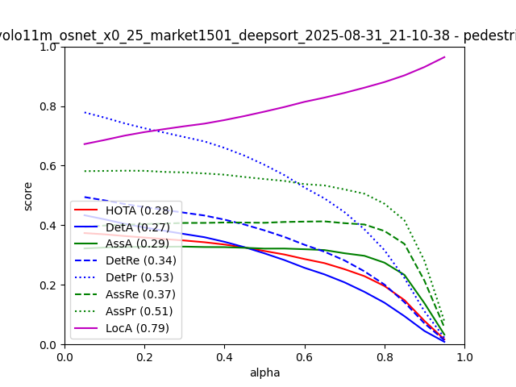
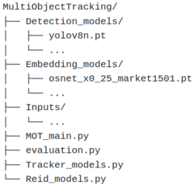
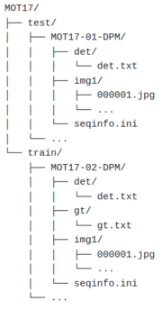

# Multi-Object Tracking Pipeline

This project focuses on object detection and tracking in videos, with the goal of developing a pipeline to automate object detection, tracking, and evaluation in video streams.

Given the wide variety of existing detection and tracking architectures, this project focuses on implementing the most commonly used approaches while maintaining a flexible framework that enables easy integration of new models.

Please refer to the PDF in the current directory for more detailed information about this project and instructions on how to run it.
For the first run and setup, please refer to the instructions below.

<br>

## First Run

1. To have a python environment containing the expected libraries for running the scripts :
```bash
conda create -n name python=3.10
conda activate name
pip install -r requirements.txt
```

2. Download MOT17 dataset, available with this command :
```bash
wget https://motchallenge.net/data/MOT17.zip
unzip MOT17.zip -d MOT17
rm -f MOT17.zip
```

3. Move MOT17 into Inputs folder :
```bash
mv MOT17 Inputs/
```

For a first run, just to understand and visualize outputs,
keep only for example the MOT17-02 and MOT17-04 sequences in MOT17 folder 
and delete all the other ones, otherwise the execution will be extremely long.

4. Execute the command :
```bash
python MOT_main.py --gen_det_images --gen_track_images --from_detections
```

<br>

## Sample Results

Sample outputs on the MOT17 dataset :

<p align="center">
<b>Detection Results</b><br>
YOLO11 Ultralytics<br>

</p>

<p align="center">
<b>Tracking Results</b><br>
DeepSORT + OSNet x0.25 (Market1501), based on YOLO11 detections<br>

</p>

<p align="center">
<b>Evaluation</b><br>
TrackEval metrics<br>

</p>

<br>

## Input Requirements and Generated Outputs

<div align="center">

<table>
<tr>
  <th>Repository Tree</th>
  <th>Inputs Folder</th>
</tr>

<tr>
  <td align="center">
    
  </td>
  <td align="center">
    
  </td>
</tr>
</table>

<br>

<table>
<tr>
  <th>Outputs Folder</th>
  <th>Outputs stored in the TrackEval Folder</th>
</tr>

<tr>
  <td align="center">
    
  </td>
  <td align="center">
    
  </td>
</tr>
</table>

