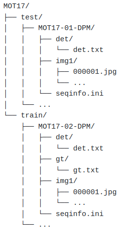
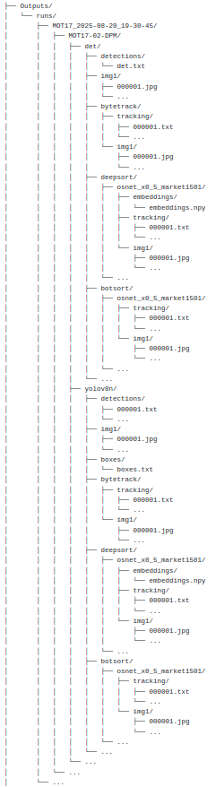
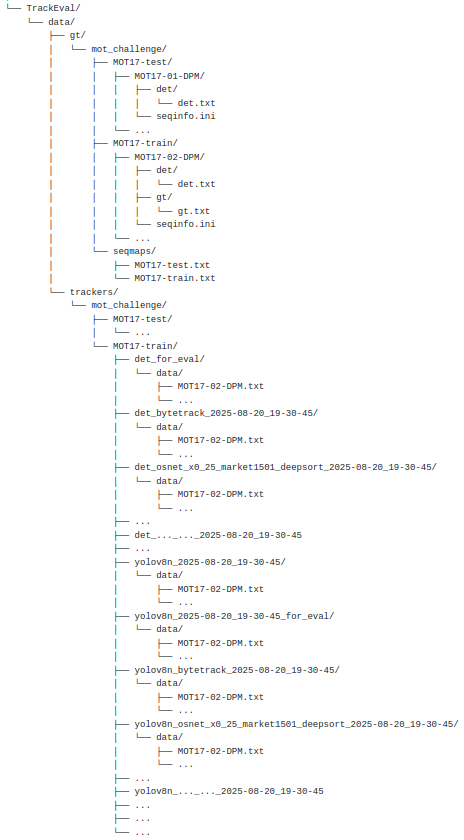

# Multi-Object Tracking Pipeline

Read the added PDF in the current directory to know what is about this project and how to run it.

FIRST RUN:

1. To have a python environment containing the expected libraries for running the scripts :
conda create -n name python=3.10
conda activate name
pip install -r requirements.txt

2. Download MOT17, available with this command:
wget https://motchallenge.net/data/MOT17.zip
unzip MOT17.zip -d MOT17
rm -f MOT17.zip

3. Move MOT17 into Inputs folder
mv MOT17 Inputs/

For a first run, just to understand and visualize outputs :
Keep only for example the MOT17-02 and MOT17-04 sequences in MOT17 folder, 
and delete all the other ones, otherwise the execution will be extremely long

4. Execute the command
python MOT_main.py --gen_det_images --gen_track_images --from_detections

<table width="100%">
<tr>
<td align="center"><b>Input</b></td>
<td align="center"><b>Output</b></td>
<td align="center"><b>TrackEval</b></td>
</tr>
<tr>
<td align="center">
  
</td>
<td align="center">
  
</td>
<td align="center">
  
</td>
</tr>
</table>
